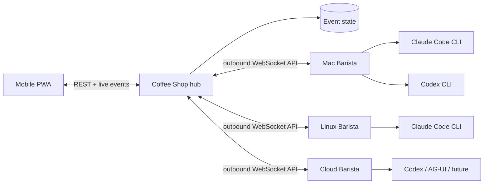

# Architecture

Coffee Shop separates identity, reasoning, and execution. That is the key choice that lets a C++ specialist remain the same agent while moving between Claude Code, Codex, and future harnesses or machines.

## Domain model

- **Agent** — stable identity, purpose, system prompt, workspace, and current state.
- **Harness** — an adapter for a model-running product. It owns invocation and event normalization, not identity.
- **Compute node** — a machine with a connected Barista, local tools, credentials, allowlisted workspaces, and concurrency.
- **Thread** — a durable, archivable body of work containing conversation, execution trees, artifacts, and the evolving outcome.
- **Run** — one immutable dispatch decision: agent + harness + model + compute + task.
- **Handoff** — a visible edge from one agent/run to another, carrying bounded task context.
- **Event** — the append-only human-readable explanation of state changes.

The UI presents agents first, matching Grok Bot's useful primitive: you return to a recognizable coworker instead of managing disposable chats. Harness and machine are visible as operational context, but they do not replace the agent's identity.

## Runtime flow

1. The PWA sends a message to an agent. A top-level message creates a thread automatically; an explicit continuation reopens a completed thread.
2. The hub snapshots that thread ID plus the agent's harness, model, workspace, and compute assignment into a run.
3. If its Barista is connected, the hub dispatches immediately; otherwise the run remains queued and visible.
4. Barista verifies that the requested workspace resolves inside an allowlisted root.
5. The harness adapter spawns an official CLI without a shell and normalizes its event stream.
6. The hub persists output and state, then pushes a fresh snapshot to every UI.
7. Every harness receives a run-scoped Coffee Shop MCP capability from Barista. It can read bounded thread and task context, refine or complete the thread, publish workspace artifacts, and, when explicitly authorized as an orchestrator, create child runs capped at three levels and four children per run.

A thread can contain multiple root execution trees as people return with follow-up work. Delegated runs, artifacts, messages, and events inherit `threadId` from the authenticated source run; models cannot attach them to an arbitrary thread. The owner agent may refine thread metadata and mark the objective completed after delegated work settles. Archival is an operator-only, reversible transition, requires all runs to be terminal, and makes the thread read-only until it is reopened.

Barista serves MCP over authenticated Streamable HTTP on an ephemeral `127.0.0.1` port. MCP calls are correlated over the existing outbound control WebSocket; the hub remains the authority for task visibility, delegation policy, persistence, and dispatch. Capability tokens are opaque, unique to one active run, never replace the Barista enrollment token, and are revoked when that run terminates. Artifact metadata travels through the control protocol, while file bytes use the authenticated hub artifact endpoint so large content does not enter MCP JSON or the lifecycle event stream.

The legacy final-response `<handoff>` directive remains a rolling-upgrade fallback. MCP delegation is first-class and non-terminal: the parent keeps working and can query the child through `get_task_context`.

Queued and running runs may also transition to `cancelled`. The hub persists that terminal state and its timestamp before attempting best-effort delivery to Barista. Late lifecycle messages cannot move a terminal run or produce output, messages, events, or handoffs. Barista keeps an in-memory cancellation tombstone for each received cancel, terminates the harness process tree, acknowledges active cancellation after that tree exits, and suppresses both a not-yet-started dispatch and terminal output from cancelled work. The persisted hub run remains the authority across a Barista disconnect.

Queued runs record `dispatchedAt` when the hub makes a persisted delivery decision; node online status alone is not evidence that a run was sent. Replayed lifecycle persistence is retried in socket order. If it remains unavailable, that socket stops before its replay barrier, so uncertain work cannot be redispatched from stale state.

## Security boundaries in the MVP

- Baristas connect outbound and authenticate with the hub secret.
- Vendor credentials remain in vendor-owned CLI storage on the compute node.
- The hub never receives a Claude or OpenAI token.
- Commands use `spawn(binary, args)` rather than shell interpolation.
- Barista canonicalizes paths before enforcing `WORKSPACE_ROOTS`.
- Claude Code runs in auto permission mode with unanswered prompts denied.
- Codex runs with `workspace-write` sandboxing.
- Automatic agent handoffs have a hard depth limit.
- MCP binds every tool call to an active run and derives thread, node, agent, parent, and workspace identity server-side.
- Only agents explicitly configured to delegate receive the `delegate_task` tool.
- Artifact paths are canonicalized beneath the active workspace; the hub verifies uploaded size and SHA-256.

The shared hub token is suitable for a private single-user tailnet, not an internet-facing team deployment. Production multi-user work needs distinct user and Barista identities, TLS, scoped grants, and an audited policy gateway.

## Repository and deployment boundaries

The repository is polyglot by application boundary. `apps/web` and `apps/hub` participate in the pnpm workspace. `apps/control-agent` is an independent Go 1.26 module joined by the root `go.work`. Root Task targets compose builds and tests without making a compute host install the TypeScript toolchain.

The hub and frontend deploy together. Barista is built and distributed separately as a native executable. Its outbound `/control-agent` WebSocket currently registers protocol version `4`; the TypeScript and Go representations intentionally live on opposite sides of the deployment boundary. Version 2 introduced the `sync.complete` replay barrier, version 3 adds correlated hub RPC for the run-scoped MCP bridge, and version 4 adds the orchestration envelopes described below. The hub accepts versions 1 through 4 during rolling upgrades and rejects any other version before dispatch. Version 1 lifecycle reporting still fail-closes queued-run redispatch because it has no safe replay barrier; version 2 retains safe lifecycle and dispatch behavior without MCP.

## Orchestration contracts (control protocol version 4)

Version 4 defines the vocabulary for distributed task orchestration and ACP harness execution. `packages/protocol/src/index.ts` is the single source of truth for every enum and transition table; this section describes semantics and does not redefine those lists.

### Protocol responsibilities

| Boundary | Protocol | Responsibilities |
|---|---|---|
| PWA ↔ hub | REST plus live WebSocket snapshots | Operator commands and projections |
| Hub ↔ Barista | Versioned Coffee Shop control protocol | Registration, inventory, dispatch, cancellation, reconciliation, structured events, approval decisions, session bindings, workspace leases |
| Barista ↔ harness | ACP v1 over local stdio | Initialization, capability negotiation, sessions, prompts, streamed updates, permission requests, cancellation |
| Harness ↔ Coffee Shop | MCP over authenticated loopback HTTP | Model-visible context, task submission, mailbox, artifacts, thread and task updates |
| Agent ↔ agent | Coffee Shop task messages | Durable, authorized, auditable communication; never a direct connection |

ACP is local to a compute node: it never crosses the hub↔Barista WebSocket, and MCP remains the only model-facing capability protocol. The shared protocol package does not depend on an ACP SDK; Barista translates ACP values into Coffee Shop's smaller normalized vocabulary, so the hub and PWA never see ACP schema names.

### Domain mapping

- **Task** — a durable, schedulable unit in a thread-owned dependency graph, with hard execution requirements, ranked preferences, dependencies, and zero or more attempts. The hub generates its identity.
- **Run** — one immutable execution attempt of a task (or of a direct message) on a concrete agent, harness, transport, model, node, and workspace. Version-4 runs record `taskId` and a one-based `attempt`.
- **Task message** — an immutable mailbox record ordered by a sequence scoped to its recipient. Acknowledgements are separate records, so messages never change after they are written. Sender identity comes from the authenticated source run.
- **Harness session binding** — associates an opaque provider session with the agent, node, harness, workspace, and thread it was created for. A failed or unsupported resume marks the binding `replaced` and records the new binding instead of dropping queued context.
- **Harness event** — a bounded, typed record normalized by Barista. Provider updates with no mapping become the `unknown` diagnostic variant, which never advances run or task state.
- **Approval** — a harness permission request owned by the hub. Only a pending approval can be resolved, and a decision applies only to the run that raised it.
- **Workspace lease** — exclusive use of an isolated worktree and branch by one run. `retained` keeps dirty or ambiguous workspaces for operator attention.

Every status vocabulary has an explicit transition table in which terminal states have no outgoing transitions. Validators reject unknown statuses, unknown or missing discriminators, undeclared event fields, and payloads over the published byte limits; they never substitute a default state.

### Compatibility policy

- Each socket registers exactly one version. The hub records it and checks every outbound message against the capability that message requires, so version-4 dispatch fields, approval decisions, and other orchestration messages are never sent to version 1–3 peers.
- Orchestration messages received on a version 1–3 connection are rejected without changing state; they are never reinterpreted as legacy output.
- Snapshots persisted before version 4 load with empty orchestration collections. Migration never invents tasks, messages, bindings, approvals, or leases.
- Barista registers version 4 to report capability evidence, and it rejects version-4 dispatch execution it cannot honor rather than falling back: a dispatch whose `execution` names a non-`native-cli` transport, or carries a `sessionBinding` or `workspaceLease`, is failed with an explicit error before any process starts, so a hub can never get silent native-behavior fallback from ACP execution it requested.

### Task graph persistence

`apps/hub/src/tasks.ts` owns the hub's task DAG. A running source run whose agent may delegate submits one batch with a batch-level idempotency key; tasks name each other with client-local keys and may also depend on existing tasks in the same thread. The whole batch is normalized (trimmed strings, requirement sets deduplicated and sorted, ranked preferences deduplicated in order, dependencies sorted), validated for malformed fields, duplicate keys, missing or cross-thread dependencies, self-edges, and cycles, and rejected as a unit on any failure. Validation runs once as a preflight and again inside `Store.transact`, where it is authoritative, so concurrent duplicates converge.

The hub records each accepted batch as a hub-internal submission holding a SHA-256 digest of the normalized batch plus the source thread and run. Replaying the key in that thread with the same digest returns the original task IDs and writes nothing; any other input under the key is an `idempotency_conflict`. Submissions are persisted but not published in snapshots.

Task status only changes through the protocol's transition table. A pending task becomes `ready` only when every dependency is satisfied; a failed, cancelled, or blocked `require-success` dependency blocks it, and blocking cascades. Cancelling a task never cancels its dependents implicitly. Runs are immutable attempts: each attempt is appended with the next one-based `attempt` number, a retryable failure returns the task to `ready` without touching earlier attempts, and results from a non-current attempt or for a terminal task are ignored. Loading fails on an unknown persisted task status or malformed task record rather than defaulting it, and migration never infers tasks from legacy `parentRunId` lineage.

### Project execution profiles and node readiness

A project profile (`ProjectProfile` in `packages/protocol/src/index.ts`) is a hub-authoritative, non-secret, versioned description of what a project needs from a node: operating system, architecture, CPU count, memory, accelerators, node-admin-declared labels, toolchains with optional version constraints, harness and transport support, and a workspace policy. The hub loads profiles from a documented JSON file — `config/project-profiles.example.json` is the checked-in illustrative example; a real deployment points `PROJECT_PROFILES_PATH` at its own file — that is separate from persisted runtime state and never contains secrets. `validateProjectProfile` rejects a profile outright if it looks like it contains one.

A node proves what it actually has via bounded, provenance-tagged capability evidence. `runtime` facts are observed directly by Barista (operating system, architecture, logical CPU count, whether any workspace root is writable); `configured` declarations are supplied by a node administrator (labels, accelerators, memory); and `probe` results come from a small, Go-compiled allowlist of toolchain version checks — Go, Git, Node, pnpm, GCC, Clang, Xcode, plus a generic "first reported version" parser. Barista never accepts an executable name or argument list from the hub, a task, or any network message; every probe is a fixed `{binary, args}` pair chosen at compile time.

`evaluateProjectReadiness`, a pure function in the protocol package shared by the hub, decides whether a node is ready for a project. It resolves each capability to `ok`, `missing`, `failed`, `stale` (older than a configurable TTL, or timestamped further in the future than a small clock-skew allowance), or `ambiguous` (disagreeing evidence from different sources), always using the freshest agreeing evidence regardless of report order, and reports every unmet hard requirement and unmet preference separately. A node-admin project allowlist and the existing `WORKSPACE_ROOTS` authorization are checked independently of the profile's own requirements and can never be widened by profile content.

The scheduler below consumes this evaluator for tasks that name a `projectProfileId`.

### Task scheduling

`apps/hub/src/scheduler.ts` solely owns matching, scoring, and placement diagnostics; dispatch callers never reimplement eligibility. A candidate is a configured agent on its configured compute node: the agent fixes the harness, model, and workspace, and the scheduler never relocates it. Every hard requirement must hold for the candidate, and a candidate that fails one is excluded:

- the agent's configured `skills` contain every required skill (compared lowercase), and its harness and model are among any required `harnessIds` and `models`;
- the node is connected, registered control protocol version 4 (`orchestration`), and has completed its reconnect barrier on the current socket; version 1–3 nodes remain accepted for legacy runs but are ineligible for task attempts with a `protocol-version` diagnostic;
- the agent's harness is reported available on the node, and a transport it reports (absent means `native-cli`; unknown values are ignored) is allowed by the task and by the project profile's hard transports;
- worker-reported evidence resolves, through `resolveNodeCapability`, to a fresh, unambiguous, matching value for every required operating system, architecture, label (`label:<name>`), and configured memory minimum; absent evidence never satisfies a requirement, and stale or future-dated evidence is reported as `inventory-stale`;
- the node's reported concurrency meets `minimumConcurrency`; the agent workspace is beneath a root the node advertises; a requested `workspace.path` is beneath both; a writable workspace requires fresh `workspace-writable` evidence; a `workspace.repository` must be authorized by the task's project profile (its `allowedRepositories`, or else its repository URL), since Barista does not yet report which repository lives beneath which root;
- a named project profile is loaded and `computeNodeProjectReadiness` reports the node ready for it, and the agent's harness is among the profile's hard `harnessIds`;
- the node has a free slot and the agent has no other active task attempt. Slots in use are the larger of the persisted queued and running runs on the node and the node's last heartbeat count, so an attempt reserves its slot the moment it is persisted and two passes can never overbook a node before heartbeats catch up. One attempt per agent keeps concurrent attempts out of a shared workspace until workspace leases isolate them.

Preferences never exclude a candidate. Eligible candidates are ranked by, in order: position of the node in `preferences.nodeIds`, of the harness in `preferences.harnessIds`, and of the model in `preferences.models` (unlisted values rank after listed ones); the number of preferred labels the node does not report; the number of unmet project-profile preferences; node utilization (slots in use divided by concurrency); then agent ID and node ID. Nothing depends on array order, timestamps, or randomness. A `placementOverride` is honored only when it is authorized by `operator` or `policy` and names an agent or node; it narrows the candidates and never bypasses a hard requirement.

When no candidate is eligible the task stays `ready`, no run is created, and `task.placement` records every unsatisfied requirement as `{ kind, requirement, nodeId, agentId, detail }`, sorted, deduplicated, and bounded to 200 entries. A diagnostic is rewritten only when its content changes.

One scheduling pass runs inside a single `Store.transact`: it re-reads every ready task whose thread is active and whose dependencies are satisfied (`readyTasks`, `taskReadiness`), creates each attempt with `assignTaskAttempt` so its slot counts against the next task in the same pass, and records a delivery decision (`dispatchedAt`) only when `canSendToControlAgent` permits the dispatch for the node's registered version. Dispatch is sent only after the transaction commits; a refused send withdraws the delivery decision, and the reconnect barrier redelivers the same run, so a failed send never creates a second attempt. Passes are coalesced and never overlap. They are triggered by registration, the reconnect barrier, capability reports, heartbeats that change a node's active-run count, run lifecycle changes, run cancellation, agent configuration changes, hub startup, and a 30-second safety interval. A task whose persisted assignment cannot be interpreted is never dispatched and gets an `assignment` diagnostic for operator attention. Direct-message, handoff, and delegated runs follow the same rule: `dispatchedAt` is persisted only when the registered version accepts the dispatch.

Registration replaces the node's inventory and discards its previous capability report, so a new Barista process is never scheduled against another process's evidence. After a version-4 reconnect barrier, which follows Barista's replay of every queued lifecycle message, a running task attempt that Barista no longer lists in `activeRunIds` has lost its compute: the run fails, harness state is settled, and `applyAttemptOutcome` returns the task to `ready` for a new attempt, up to three attempts per task, after which the task fails. Queued attempts are redispatched rather than failed, and only while they are still their task's current assignment, so reconciliation never duplicates a running attempt or resurrects cancelled work. All inventory the scheduler matches is worker-reported, never attested.

### Structured harness events and approvals

Barista forwards each normalized event as one `harness.event` envelope on the version-4 control socket, alongside the legacy `run.output` text that version 1–3 hubs and the existing run inspector still consume. Barista owns the forwarded `sequence`: it starts at 1 for every run and advances only for events actually written or queued. While the hub is unreachable, ordinary events queue within a bounded outbox (2,048 events or 8 MiB); beyond that they are dropped and a single `barista-events-dropped` warning takes the next sequence once forwarding resumes, so the hub never sees a gap caused by backpressure. Permission events are never dropped.

`apps/hub/src/harnessEvents.ts` owns ordering, limits, and the `runActivity` projection. An event is accepted only from the socket currently registered for the run's node, for a `running` run whose session binding matches, and only as the next sequence. An exact replay of a recently accepted sequence is ignored; a conflicting replay, a replay too old to verify, a gap, a contradictory permission update, or a secret inside an identity field stops that run's stream, flags its activity as `failed`, and cancels its pending approvals. Events for queued or terminal runs, other nodes, or older protocol versions are rejected without any state change. Accepted events are redacted (the hub token plus common credential shapes such as API keys, bearer credentials, and private keys) before they are retained, projected, or broadcast, and each acceptance persists the event, its projection, and any approval change in one transaction.

The projection keeps bounded display state per run: the most recent 256 KiB of message text and 64 KiB of thought text, a 2 KiB summary, the latest plan, up to 500 tool calls upserted by ID, 100 diffs upserted by path and tool call, 16 terminals with the last 64 KiB of each stream, merged usage, and the last 50 warnings. Truncation is always marked: accumulated text reports `truncatedBytes` for the leading bytes it dropped, a shortened single field ends with ` [truncated]`, a diff over 64 KiB per side or past the run's 1 MiB diff budget is `truncated`, and `omitted` counts items beyond a count limit. Raw redacted events are retained hub-side (never in snapshots) up to 1,000 events or 1 MiB per run, for the 20 most recent event-producing runs; projections are kept for the 100 most recent. `GET /api/runs/:id/events?after=N` returns the retained records with the current projection.

A `permission.requested` event opens an approval with a hub-generated ID, bound to the harness approval ID, run, node, and session binding, that expires nine minutes after the hub received it (shorter than Barista's ten-minute callback timeout). Operators list approvals with `GET /api/approvals` and resolve one with `POST /api/approvals/:id/resolution`, sending `{ idempotencyKey, expectedStatus: "pending", optionId }` or `{ idempotencyKey, expectedStatus: "pending", cancel: true }` and optionally the expected `runId`. An offered `allow-*` option approves and a `reject-*` option rejects; an option that was not offered is a 422. A resolution that is not pending, expired, for an ended run, or for a replaced session is a 409; replaying the same key and choice returns the stored resolution. These endpoints use the hub's existing bearer authentication.

The resolution is persisted before an `approval.decision` is written, and delivery is tracked separately as `pending`, `sent`, `applied`, or `not-applied`. Only the harness's own `permission.resolved` event confirms a decision as `applied`. A decision for an offline Barista stays `pending` and is redelivered after the reconnect barrier only if the same run is still active on the same node and session and the approval has not expired; otherwise it becomes `not-applied`. It is never retargeted. Barista releases only the matching live ACP callback, verifies that the selected option was offered and matches the decision, treats an exact redelivery as a no-op, and answers anything else with `approval.undeliverable`, which the hub records as `not-applied`. Run completion, failure, or cancellation cancels pending approvals and marks unconfirmed decisions `not-applied`; a harness-side timeout or cancellation resolves a still-pending approval as `expired` or `cancelled`. Nothing a harness reports can approve or reject an approval on its own. Pending and undelivered approvals are always kept; settled ones are pruned oldest first beyond 50 per run and 500 in total.

## What to build next

The MVP deliberately proves the seams before adding infrastructure. Recommended order:

1. Replace the JSON snapshot with PostgreSQL and append-only run/event tables.
2. Add OIDC for users and per-Barista enrollment tokens with rotation.
3. Add a scheduler/lease table so multiple hub replicas cannot dispatch the same run.
4. Build the PWA approval and structured-activity views on top of the hub's approval endpoints and `runActivity` projection.
5. Move artifact content from hub-local storage to object storage with signed upload and download URLs.
6. Add container/VM workspace providers and a policy engine before untrusted workloads.
7. Add AG-UI as an external harness adapter while preserving the same run/event model.
8. Add routines only after retries, idempotency, cancellation, and budgets are durable.

## Deliberate non-goals in this bootstrap

- No credential vault or credential proxy.
- No public multi-tenant auth.
- No unrestricted arbitrary shell harness.
- No pretend memory layer: durable memory needs provenance, retention, and compaction semantics.
- No direct SSH orchestration; a small outbound Barista is simpler to secure and works across NAT.
