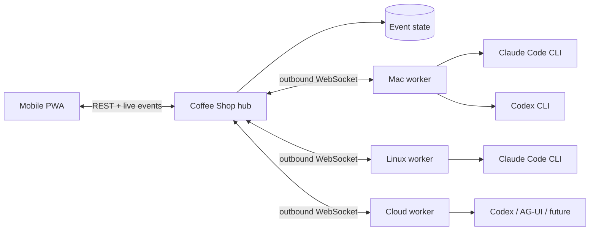

# Architecture

Coffee Shop separates identity, reasoning, and execution. That is the key choice that lets a C++ specialist remain the same agent while moving between Claude Code, Codex, and future harnesses or machines.

## Domain model

- **Agent** — stable identity, purpose, system prompt, workspace, and current state.
- **Harness** — an adapter for a model-running product. It owns invocation and event normalization, not identity.
- **Compute node** — a connected worker with local tools, credentials, allowlisted workspaces, and concurrency.
- **Run** — one immutable dispatch decision: agent + harness + model + compute + task.
- **Handoff** — a visible edge from one agent/run to another, carrying bounded task context.
- **Event** — the append-only human-readable explanation of state changes.

The UI presents agents first, matching Grok Bot's useful primitive: you return to a recognizable coworker instead of managing disposable chats. Harness and machine are visible as operational context, but they do not replace the agent's identity.

## Runtime flow

1. The PWA sends a message to an agent.
2. The hub snapshots that agent's harness, model, workspace, and compute assignment into a run.
3. If its worker is connected, the hub dispatches immediately; otherwise the run remains queued and visible.
4. The worker verifies that the requested workspace resolves inside an allowlisted root.
5. The harness adapter spawns an official CLI without a shell and normalizes its event stream.
6. The hub persists output and state, then pushes a fresh snapshot to every UI.
7. A typed handoff directive becomes a new event and child run, capped at three levels.

## Security boundaries in the MVP

- Workers connect outbound and authenticate with the hub secret.
- Vendor credentials remain in vendor-owned CLI storage on the worker.
- The hub never receives a Claude or OpenAI token.
- Commands use `spawn(binary, args)` rather than shell interpolation.
- Workers canonicalize paths before enforcing `WORKSPACE_ROOTS`.
- Claude Code runs in auto permission mode with unanswered prompts denied.
- Codex runs with `workspace-write` sandboxing.
- Automatic agent handoffs have a hard depth limit.

The shared hub token is suitable for a private single-user tailnet, not an internet-facing team deployment. Production multi-user work needs distinct user and worker identities, TLS, scoped grants, and an audited policy gateway.

## What to build next

The MVP deliberately proves the seams before adding infrastructure. Recommended order:

1. Replace the JSON snapshot with PostgreSQL and append-only run/event tables.
2. Add OIDC for users and per-worker enrollment tokens with rotation.
3. Add a scheduler/lease table so multiple hub replicas cannot dispatch the same run.
4. Add approval events that can pause a harness and be resolved from the PWA.
5. Add artifact metadata plus signed download URLs; keep large output out of the event log.
6. Add container/VM workspace providers and a policy engine before untrusted workloads.
7. Add AG-UI as an external harness adapter while preserving the same run/event model.
8. Add routines only after retries, idempotency, cancellation, and budgets are durable.

## Deliberate non-goals in this bootstrap

- No credential vault or credential proxy.
- No public multi-tenant auth.
- No unrestricted arbitrary shell harness.
- No pretend memory layer: durable memory needs provenance, retention, and compaction semantics.
- No direct SSH orchestration; a small outbound worker is simpler to secure and works across NAT.
