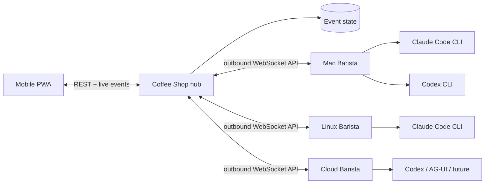

# Architecture

Coffee Shop separates identity, reasoning, and execution. That is the key choice that lets a C++ specialist remain the same agent while moving between Claude Code, Codex, and future harnesses or machines.

## Domain model

- **Agent** — stable identity, purpose, system prompt, workspace, and current state.
- **Harness** — an adapter for a model-running product. It owns invocation and event normalization, not identity.
- **Compute node** — a machine with a connected Barista, local tools, credentials, allowlisted workspaces, and concurrency.
- **Thread** — a durable, archivable body of work containing conversation, execution trees, artifacts, and the evolving outcome.
- **Run** — one immutable dispatch decision: agent + harness + model + compute + task.
- **Handoff** — a visible edge from one agent/run to another, carrying bounded task context.
- **Event** — the append-only human-readable explanation of state changes.

The UI presents agents first, matching Grok Bot's useful primitive: you return to a recognizable coworker instead of managing disposable chats. Harness and machine are visible as operational context, but they do not replace the agent's identity.

## Runtime flow

1. The PWA sends a message to an agent. A top-level message creates a thread automatically; an explicit continuation reopens a completed thread.
2. The hub snapshots that thread ID plus the agent's harness, model, workspace, and compute assignment into a run.
3. If its Barista is connected, the hub dispatches immediately; otherwise the run remains queued and visible.
4. Barista verifies that the requested workspace resolves inside an allowlisted root.
5. The harness adapter spawns an official CLI without a shell and normalizes its event stream.
6. The hub persists output and state, then pushes a fresh snapshot to every UI.
7. Every harness receives a run-scoped Coffee Shop MCP capability from Barista. It can read bounded thread and task context, exchange durable task messages, wait for task events, report task progress, refine or complete the thread, publish workspace artifacts, and, when explicitly authorized as an orchestrator, inspect execution inventory and submit task batches capped at three levels of nesting.

A thread can contain multiple root execution trees as people return with follow-up work. Delegated runs, artifacts, messages, and events inherit `threadId` from the authenticated source run; models cannot attach them to an arbitrary thread. The owner agent may refine thread metadata and mark the objective completed after delegated work settles. Archival is an operator-only, reversible transition, requires all runs to be terminal, and makes the thread read-only until it is reopened.

Barista serves MCP over authenticated Streamable HTTP on an ephemeral `127.0.0.1` port. MCP calls are correlated over the existing outbound control WebSocket; the hub remains the authority for task visibility, delegation policy, persistence, and dispatch. Capability tokens are opaque, unique to one active run, never replace the Barista enrollment token, and are revoked when that run terminates. Artifact metadata travels through the control protocol, while file bytes use the authenticated hub artifact endpoint so large content does not enter MCP JSON or the lifecycle event stream.

The legacy final-response `<handoff>` directive remains a rolling-upgrade fallback. MCP delegation is first-class and non-terminal: the parent keeps working, can query the child through `get_task_context`, and can wait for its messages and state changes with `wait_for_task_events`.

Queued and running runs may also transition to `cancelled`. The hub persists that terminal state and its timestamp before attempting best-effort delivery to Barista. Late lifecycle messages cannot move a terminal run or produce output, messages, events, or handoffs. Barista keeps an in-memory cancellation tombstone for each received cancel, terminates the harness process tree, acknowledges active cancellation after that tree exits, and suppresses both a not-yet-started dispatch and terminal output from cancelled work. The persisted hub run remains the authority across a Barista disconnect.

Queued runs record `dispatchedAt` when the hub makes a persisted delivery decision; node online status alone is not evidence that a run was sent. Replayed lifecycle persistence is retried in socket order. If it remains unavailable, that socket stops before its replay barrier, so uncertain work cannot be redispatched from stale state.

## Security boundaries in the MVP

- Baristas connect outbound and authenticate with the hub secret.
- Vendor credentials remain in vendor-owned CLI storage on the compute node.
- The hub never receives a Claude or OpenAI token.
- Commands use `spawn(binary, args)` rather than shell interpolation.
- Barista canonicalizes paths before enforcing `WORKSPACE_ROOTS`.
- Claude Code runs in auto permission mode with unanswered prompts denied.
- Codex runs with `workspace-write` sandboxing.
- Both hold under the default `manual` approval policy; only a compute node's administrator can relax it for a harness with Barista's `--approval-policy`, and the hub merely displays the result.
- Automatic agent handoffs have a hard depth limit.
- MCP binds every tool call to an active run and derives thread, node, agent, parent, and workspace identity server-side.
- Only agents explicitly configured to delegate receive `delegate_task`, `submit_tasks`, and `get_execution_inventory`; the hub re-checks that permission on every call.
- A task, message, or artifact outside the caller's thread or lineage is rejected exactly as a nonexistent one would be.
- Artifact paths are canonicalized beneath the active workspace; the hub verifies uploaded size and SHA-256.

The shared hub token is suitable for a private single-user tailnet, not an internet-facing team deployment. Production multi-user work needs distinct user and Barista identities, TLS, scoped grants, and an audited policy gateway.

## Repository and deployment boundaries

The repository is polyglot by application boundary. `apps/web` and `apps/hub` participate in the pnpm workspace. `apps/control-agent` is an independent Go 1.26 module joined by the root `go.work`. Root Task targets compose builds and tests without making a compute host install the TypeScript toolchain.

The hub and frontend deploy together. Barista is built and distributed separately as a native executable. Its outbound `/control-agent` WebSocket registers protocol version `5`; the TypeScript and Go representations intentionally live on opposite sides of the deployment boundary. Version 2 introduced the `sync.complete` replay barrier, version 3 correlated hub RPC, version 4 orchestration, and version 5 ephemeral instances plus resident reconciliation. The hub accepts versions 1 through 5 during rolling upgrades and rejects any other version. Versions 1–4 retain only the behavior their advertised capability supports; they can settle compatible legacy work but are never provisioned with a new instance.

## Orchestration contracts (control protocol versions 4 and 5)

Version 4 defines the vocabulary for distributed task orchestration and ACP harness execution. `packages/protocol/src/index.ts` is the single source of truth for every enum and transition table; this section describes semantics and does not redefine those lists.

### Protocol responsibilities

| Boundary | Protocol | Responsibilities |
|---|---|---|
| PWA ↔ hub | REST plus live WebSocket snapshots | Operator commands and projections |
| Hub ↔ Barista | Versioned Coffee Shop control protocol | Registration, inventory, dispatch, cancellation, reconciliation, structured events, approval decisions, session bindings, workspace leases |
| Barista ↔ harness | ACP v1 over local stdio | Initialization, capability negotiation, sessions, prompts, streamed updates, permission requests, cancellation |
| Harness ↔ Coffee Shop | MCP over authenticated loopback HTTP | Model-visible context, task submission, mailbox, artifacts, thread and task updates |
| Agent ↔ agent | Coffee Shop task messages | Durable, authorized, auditable communication; never a direct connection |

ACP is local to a compute node: it never crosses the hub↔Barista WebSocket, and MCP remains the only model-facing capability protocol. The shared protocol package does not depend on an ACP SDK; Barista translates ACP values into Coffee Shop's smaller normalized vocabulary, so the hub and PWA never see ACP schema names.

### Domain mapping

- **Task** — a durable, schedulable unit in a thread-owned dependency graph, with hard execution requirements, ranked preferences, dependencies, and zero or more attempts. The hub generates its identity.
- **Run** — one immutable execution attempt of a task (or of a direct message) on a concrete agent, harness, transport, model, node, and workspace. Version-4 runs record `taskId` and a one-based `attempt`.
- **Task message** — an immutable mailbox record ordered by a sequence scoped to its recipient. Acknowledgements are separate records, so messages never change after they are written. Sender identity comes from the authenticated source run.
- **Harness session binding** — associates an opaque provider session with the agent, node, harness, workspace, and thread it was created for. A failed or unsupported resume marks the binding `replaced` and records the new binding instead of dropping queued context.
- **Harness event** — a bounded, typed record normalized by Barista. Provider updates with no mapping become the `unknown` diagnostic variant, which never advances run or task state.
- **Approval** — a harness permission request owned by the hub. Only a pending approval can be resolved, and a decision applies only to the run that raised it. Every resolution records who made it: an operator, a configured policy, the hub itself on expiry or run termination, or a named external orchestrator client and attachment.
- **Workspace lease** — exclusive use of an isolated workspace by one run: a dedicated Git worktree and branch (`git-worktree`) or an existing checkout (`exclusive-existing`). `retained` keeps dirty, diverged, or ambiguous workspaces for operator attention.

Every status vocabulary has an explicit transition table in which terminal states have no outgoing transitions. Validators reject unknown statuses, unknown or missing discriminators, undeclared event fields, and payloads over the published byte limits; they never substitute a default state.

### Compatibility policy

- Each socket registers exactly one version. The hub records it and checks every outbound message against the capability that message requires, so version-4 dispatch fields, approval decisions, and other orchestration messages are never sent to version 1–3 peers.
- Orchestration messages received on a version 1–3 connection are rejected without changing state; they are never reinterpreted as legacy output.
- Snapshots persisted before version 4 load with empty orchestration collections. Migration never invents tasks, messages, bindings, approvals, or leases.
- Current Barista registers version 5 and rejects dispatch execution it cannot honor rather than degrading it: an `acp-v1` dispatch is accepted only when a verified adapter is available for the harness (or the dispatch and node operator both permit native fallback), resumable sessions and workspace leases must exactly match their run, and an instance dispatch must name the resident's exact allocation. Every refusal happens before a process or prompt starts. A permitted native fallback is never silent: it happens only for an enumerated reason detected before the ACP prompt, and `run.started` reports it.

### Transport selection

The scheduler's choice is the attempt's requested `transport`, persisted on the immutable run. Barista makes the final selection once, before the harness receives the prompt, and reports it on `run.started` as `transport` (`RunTransportSelection`): requested and selected transports, a fallback reason when they differ, the native CLI version, the verified adapter's id, version, and source, and the ACP capabilities negotiated for the run. The hub records a well-formed selection that matches the run's requested transport and permitted fallback on `run.transportSelection`, exposes it on task attempts, and adds a timeline event when the run fell back; anything else is not recorded and is reported as a timeline event. A failure after the prompt is sent fails the attempt; a retry is a new attempt that selects its transport anew.

### ACP status: where it is the preferred path

ACP is the preferred transport exactly where the end-to-end acceptance suite (`task system:test`, `apps/control-agent/internal/systemtest`) proves it, and nowhere else:

| Execution | Preferred transport | Evidence |
|---|---|---|
| Task attempts on a node whose harness advertises `acp-v1` (a verified adapter passed its startup probe) | `acp-v1`; `native-cli` when no adapter is advertised or the task or profile excludes ACP | Codex and Claude attempts run concurrently over ACP on two real Barista processes, with structured plan, tool, diff, and usage events, approval accept, reject, and expiry, cancellation, adapter crash, and malformed-frame handling |
| Orchestrator continuations (wakes) | `acp-v1` when the owner's harness advertises it | A wake opens a new session, the next resumes it, and a stale provider session is replaced with bounded durable context; every inbox event is delivered to exactly one wake |
| ACP failure before the prompt on a node whose operator enabled `--acp-native-fallback` | `native-cli`, recorded as a fallback | The run completes through the native CLI with `transportSelection.fallbackReason` and a `transport-native-fallback` warning |
| Direct operator messages, handoffs, and version 1–3 Baristas | `native-cli` only | Direct runs never carry an `execution` object; version-3 nodes keep direct runs and never receive task attempts |

The suite drives real hub and Barista processes but replaces every provider executable with `fakeharness`, which reproduces the pinned adapters' identity (codex-acp 1.12.0, claude-agent-acp 0.79.0), configuration options, and ACP framing without contacting a provider. It therefore proves Coffee Shop's side of the contract; it does not prove that a particular real adapter build behaves identically, which each node establishes with its startup probe and `barista doctor`. Claude over ACP additionally stays experimental at the account boundary and loads only with an explicit `--claude-acp-auth-mode` (see `docs/anthropic-usage.md`). The native CLI paths are not removed and remain the fallback. Operating procedures are in `docs/operations.md`.

Managed-component selection is process-local by design. Setup writes verified ownership and activation ledgers, but a daemon snapshots its manifest and ledgers at startup and never hot-adopts later changes. It keeps running and reporting the selected executable it actually loaded, emits one restart-required notice when the activation record changes, and adopts the new version only after restart. At that boundary the stable version-5 instance survives, its process-local allocation becomes lost history, and one new allocation generation is authoritative. Rollback consumes one re-verified retained target rather than swapping versions, and prune removes only verified inactive owned bytes.

### Task graph persistence

`apps/hub/src/tasks.ts` owns the hub's task DAG. A running source run whose agent may delegate submits one batch with a batch-level idempotency key; tasks name each other with client-local keys and may also depend on existing tasks in the same thread. The whole batch is normalized (trimmed strings, requirement sets deduplicated and sorted, ranked preferences deduplicated in order, dependencies sorted), validated for malformed fields, duplicate keys, missing or cross-thread dependencies, self-edges, and cycles, and rejected as a unit on any failure. Validation runs once as a preflight and again inside `Store.transact`, where it is authoritative, so concurrent duplicates converge.

The hub records each accepted batch as a hub-internal submission holding a SHA-256 digest of the normalized batch plus the source thread and run. Replaying the key in that thread with the same digest returns the original task IDs and writes nothing; any other input under the key is an `idempotency_conflict`. Submissions are persisted but not published in snapshots.

Task status only changes through the protocol's transition table. A pending task becomes `ready` only when every dependency is satisfied; a failed, cancelled, or blocked `require-success` dependency blocks it, and blocking cascades. Cancelling a task never cancels its dependents implicitly. Runs are immutable attempts: each attempt is appended with the next one-based `attempt` number, a retryable failure returns the task to `ready` without touching earlier attempts, and results from a non-current attempt or for a terminal task are ignored. Loading fails on an unknown persisted task status or malformed task record rather than defaulting it, and migration never infers tasks from legacy `parentRunId` lineage.

### Orchestration tools and task mailboxes

The run-scoped MCP server exposes the tools in `hubToolNames` (`packages/protocol/src/index.ts`); Barista lists exactly those names, and `delegationHubToolNames` only to agents allowed to delegate. The shared fixtures in `packages/protocol/test/fixtures/hub-tools` hold the vocabulary and the listed tool schemas: Go tests check Barista's definitions against them and hub tests validate every structured result against the output schemas. `apps/hub/src/hubTools.ts` maps each correlated RPC to one domain service; none reimplements validation.

- `get_execution_inventory` returns configured agents (skills, harness, model, node) and nodes (connection readiness, capacity, harness models and transports, and each worker-reported capability resolved through `resolveNodeCapability` with its freshness). It never returns system prompts, workspace paths, binary locations, raw evidence, or diagnostics, and every collection is bounded.
- `submit_tasks` submits one atomic batch through `submitTaskBatch`. A per-task `pin` is the only way a model narrows placement: it is accepted from an agent allowed to delegate, stored as a `policy`-authorized placement override that the scheduler applies without relaxing any hard requirement, rejects unknown agents or nodes, and is part of the batch's idempotency identity. The hub requests a scheduling pass after the batch commits and waits a bounded two seconds for it only to report any assignment or diagnostics; submission never depends on placement. Source runs at depth three cannot submit, and a run may create at most 128 tasks.
- `delegate_task` is an adapter over the same path: one task pinned to the named agent, under the historical limits of depth three and four tasks per source run. It never creates a run directly. A target that could never be placed — a missing agent, the caller itself, or an agent whose harness, model, transport, or workspace its node does not support, as judged by the scheduler's `staticPlacementFailures` — is rejected as `target_ineligible` without writing anything; a target that is only offline, busy, or awaiting fresh evidence is still queued.
- `send_task_message` appends an immutable message. The sender is the caller: a task attempt speaks for its task, and a non-task run of the thread owner speaks as the thread orchestrator. The orchestrator may message any task in its thread; a task may message the orchestrator, its ancestors, and its descendants. Messages are ordered by a sequence allocated per recipient mailbox inside the transaction; replies must reference a message the caller sent or received; attachments must be uploaded artifacts of the same thread.
- `wait_for_task_events` long-polls for messages addressed to the caller and for status, attempt, and progress changes of tasks it can read (its own task, ancestors, descendants, and direct dependencies; every task for the orchestrator). It may acknowledge messages first; acknowledgements are separate records and never change a message.
- `update_task` lets a task's current assignee report progress, an advisory blocked reason, or completion fields. It never changes task status, which still follows the attempt's run.
- `get_task_context` keeps its earlier fields and adds the caller's role, the durable task projection, child tasks, the visible task graph, and a mailbox summary with a cursor at the current head. `taskId` names a visible durable task or, for older callers, a run in the caller's run lineage.

Every mutation requires a caller-scoped idempotency key: task batches per thread, messages per sender mailbox, and task updates per task. The stored record keeps the source run, and an exact replay from the same run returns the original authoritative IDs with `created: false`; any difference is an `idempotency_conflict` that changes nothing. Tool errors carry `{ code, message, retryable }`; a lost control connection or timeout is reported as retryable, and retrying with the same key converges.

`Store.transact` compares each committed state with the one it replaced and appends every new message and every task status, attempt, or progress change to a hub-only journal under a per-thread sequence, so no mutation path can skip a wake-up. The journal keeps the latest 2,000 entries per thread. A wait resolves as soon as a relevant entry commits, at its timeout (at most 20 seconds, below Barista's 30-second RPC timeout), when its control socket closes, or when a third concurrent wait from the same run displaces it; it holds no transaction or socket while pending and is served outside the socket's serialized message handling. Ending a wait never consumes events. Cursors are opaque, checksummed encodings of the thread, the caller's mailbox scope, and the last journal sequence seen; a cursor that is malformed, issued to another caller, or ahead of the journal is `cursor_invalid`, and one older than the retained entries is `cursor_stale`. Neither ever restarts silently at the head.

### Session bindings and orchestrator continuation

`apps/hub/src/sessionBindings.ts` persists harness session bindings. Barista reports each ACP session once, with `session.binding` (status `active`), after the session exists and before its prompt; the hub accepts it only from the run's own node, for a dispatched ACP run that has not started, with a provider session ID that does not look like a credential and is not already owned by another binding. A report naming a binding is accepted only as the resume that run's dispatch asked for; any other report creates a new binding (identity, lineage, and workspace — the lease worktree for a leased run — come from the run), marks the binding the run named as `replaced`, and moves the run to the new binding, so approvals and event streams bind to the session that actually raised them. When a run ends, `settleHarnessStateForTerminalRun` makes the session of a thread owner's non-task run `idle` if its ACP turn completed, recording the capabilities that run negotiated and closing any older idle binding in the same context, so at most one session per context stays resumable; the session of any other run, such as a task attempt, is `closed`, and any other ending fails it. A binding a run asked to resume but that failed before its prompt is failed too, unless Barista refused the dispatch only because its adapter cannot resume: that binding stays idle, the wake records `resumeRefused`, and the range is retried at once with a new session that never asks for that binding again. Terminal bindings are kept for lineage only, 500 at most. A binding is never moved: every dispatch and redispatch carries `execution.sessionBinding` only for an `acp-v1` run in the binding's own thread, agent, node, harness, workspace, and lease whose recorded capabilities include resume or load, whose node's current registered inventory still advertises resume or load, and whose session is idle or already bound to that run; otherwise the dispatched run omits `sessionBindingId` and Barista starts a new session with the bounded durable context. An orchestrator's `wait_for_task_events` cursor acknowledges processing only once every argument of the call is valid.

`apps/hub/src/orchestratorInbox.ts` owns orchestrator wakes. A thread's `OrchestratorInbox` (published in snapshots) records `deliveredThrough` and `processedThrough` journal sequences. Relevant events are messages to the orchestrator, terminal task transitions, and progress while a task reports a blocked reason. Only an orchestrator run's explicit cursor advances processing: the cursor it passes to `wait_for_task_events` acknowledges every sequence up to it, and a page it receives marks sequences up to the returned cursor delivered. Provider session history never marks anything processed.

Every scheduling pass, in its own transaction, reconciles each open wake with its run — a started run delivered its range; a finished run completes or fails its wake; a continuation not dispatched within ten minutes is cancelled — and then, for each active thread whose owner has no active non-task run (a run blocked in `wait_for_task_events` is served by that wait instead), creates at most one continuation run for the oldest 50 unacknowledged relevant events, placed by the scheduler's own evaluation of the owner agent. Wake and run identities derive from the thread, the sequence range, and a per-thread generation. An idle, compatible binding whose node still advertises resume or load is resumed; the dispatch then carries the delivery-only `resumePrompt`, while the run prompt always prefixes it with bounded durable thread context (`apps/hub/src/orchestratorContext.ts`), which a replacement ACP session or a native CLI run receives. Every event in the range is listed by sequence and identity, content is shortened with explicit byte counts, and the prompt ends with the exact cursor that acknowledges the range. A range already delivered but never acknowledged is redelivered at most twice until new events arrive; failed continuations back off exponentially from five seconds to ten minutes. After a reconnect barrier a running continuation Barista no longer reports fails like a lost task attempt, and its unacknowledged range is offered to the next continuation.

### Project execution profiles and node readiness

A project profile (`ProjectProfile` in `packages/protocol/src/index.ts`) is a hub-authoritative, non-secret, versioned description of what a project needs from a node: operating system, architecture, CPU count, memory, accelerators, node-admin-declared labels, toolchains with optional version constraints, harness and transport support, and a workspace policy. Profiles are managed through authenticated hub APIs and the PWA, persisted with the rest of hub state in SQLite, and published in snapshots so every operator view updates live. `config/project-profiles.example.json` is only an illustrative schema and legacy one-time import source. `validateProjectProfile` rejects a profile outright if it looks like it contains one.

A node proves what it actually has via bounded, provenance-tagged capability evidence. `runtime` facts are observed directly by Barista (operating system, architecture, logical CPU count, whether any workspace root is writable, which workspace lease policies it can provision); `configured` declarations are supplied by a node administrator (labels, accelerators, memory); and `probe` results come from a small, Go-compiled allowlist of toolchain version checks — Go, Git, Node, pnpm, GCC, Clang, Xcode, plus a generic "first reported version" parser. Barista never accepts an executable name or argument list from the hub, a task, or any network message; every probe is a fixed `{binary, args}` pair chosen at compile time.

`evaluateProjectReadiness`, a pure function in the protocol package shared by the hub, decides whether a node is ready for a project. It resolves each capability to `ok`, `missing`, `failed`, `stale` (older than a configurable TTL, or timestamped further in the future than a small clock-skew allowance), or `ambiguous` (disagreeing evidence from different sources), always using the freshest agreeing evidence regardless of report order, and reports every unmet hard requirement and unmet preference separately. A node-admin project allowlist and the existing `WORKSPACE_ROOTS` authorization are checked independently of the profile's own requirements and can never be widened by profile content.

The scheduler below consumes this evaluator for tasks that name a `projectProfileId`.

### Task scheduling

`apps/hub/src/scheduler.ts` solely owns matching, scoring, and placement diagnostics; dispatch callers never reimplement eligibility. The primary path is **node → live harness offering → instance → allocation → run**. A version-5 node publishes harness/model/transport/workspace offerings and separate run and resident capacities. Placement creates or reuses a thread-scoped instance, reserves one exact allocation, waits for `instance.ready`, and only then creates a run. The runtime actor key is always the pair `{instanceId, allocationId}`: the stable instance identity survives allocation loss, while an old allocation never authorizes work or session reuse on its replacement. Configured agents remain a compatibility candidate, not the identity of new instance work.

Every hard requirement must hold for an offering or compatible legacy candidate, and a candidate that fails one is excluded:

- the agent's configured `skills` contain every required skill (compared lowercase), and its harness and model are among any required `harnessIds` and `models`;
- the node is connected and has completed its reconnect barrier; new instance work requires protocol version 5 (`instances`), while versions 1–4 remain accepted only for their compatibility behavior and receive an explicit `protocol-version` diagnostic for instance placement;
- the agent's harness is reported available on the node and still advertises the agent's model (a harness with no model list accepts only `default`), and a transport it reports (absent means `native-cli`; unknown values are ignored) is allowed by the task and by the project profile's hard transports. Among allowed transports `acp-v1` is preferred, since Barista advertises it only for a verified adapter that passed its startup probe; when `native-cli` is also advertised and allowed, the attempt records `fallbackTransport: "native-cli"`, the only fallback Barista may use;
- worker-reported evidence resolves, through `resolveNodeCapability`, to a fresh, unambiguous, matching value for every required operating system, architecture, label (`label:<name>`), and configured memory minimum; absent evidence never satisfies a requirement, and stale or future-dated evidence is reported as `inventory-stale`;
- the node's reported concurrency meets `minimumConcurrency`; the agent workspace is beneath a root the node advertises; a requested `workspace.path` is beneath both; a writable workspace requires fresh `workspace-writable` evidence; a `workspace.repository` must be authorized by the task's project profile (its `allowedRepositories`, or else its repository URL), since Barista does not yet report which repository lives beneath which root;
- a named project profile is loaded and `computeNodeProjectReadiness` reports the node ready for it, and the agent's harness is among the profile's hard `harnessIds`;
- a project profile with a workspace `isolation` policy requires fresh `workspace-lease:<policy>` evidence and a lease that can be planned (see below); an `exclusive-existing` workspace already held by another unsettled lease is a `capacity` diagnostic, so the second task stays `ready`;
- the node has a free slot and, unless the attempt gets its own `git-worktree` lease, the agent has no other active task attempt sharing its workspace. Slots in use are the larger of the persisted queued and running runs on the node and the node's last heartbeat count, so an attempt reserves its slot the moment it is persisted and two passes can never overbook a node before heartbeats catch up. Worktree-leased attempts write only to their own worktree, so one agent may run several of them at once, bounded by node concurrency.

Preferences never exclude a candidate. Eligible offerings are ranked deterministically by declared node/harness/model/label preferences, project preferences, transport, run utilization, resident utilization, and stable identifiers. An authorized `placementOverride.instanceId` is an exact pin: it may provision that requested identity or reuse its active allocation, but it never falls back to another instance, offering, or configured agent. `AgentTemplate` records contribute reusable purpose, instruction, skill, requirement, preference, avatar, and delegation defaults only; they are not workers, allocations, sessions, or capacity.

Lifecycle authority is thread-scoped. `spawn_instance`, `get_instance`, `renew_instance`, and `release_instance` derive the caller from the authenticated bridge or live run. Stable idempotency keys replay the original instance/allocation/task identities; changing semantic input conflicts. Drain rejects new work and waits for active work, while cancel terminates it. Release is complete only after the exact current allocation acknowledges cleanup. Public tool projections omit creator authority, private purpose instructions, allocation workspace, provider sessions, credentials, and historical allocations.

When no candidate is eligible the task stays `ready`, no run is created, and `task.placement` records every unsatisfied requirement as `{ kind, requirement, nodeId, agentId, detail }`, sorted, deduplicated, and bounded to 200 entries. A diagnostic is rewritten only when its content changes.

One scheduling pass runs inside a single `Store.transact`: it re-reads every ready task whose thread is active and whose dependencies are satisfied (`readyTasks`, `taskReadiness`), creates each attempt with `assignTaskAttempt` so its slot counts against the next task in the same pass, and records a delivery decision (`dispatchedAt`) only when `canSendToControlAgent` permits the dispatch for the node's registered version. Each delivery decision is bound to the exact connection (socket and registration generation) it was approved against, and a connection may approve a dispatch only after it has passed its reconnect barrier (version 1 has none). Dispatch is sent only after the transaction commits and only while that connection is still current; otherwise the decision is withdrawn, and the new connection's barrier dispatches the run exactly once (each connection records the runs it has dispatched), so a failed or superseded send never creates a second attempt or a duplicate delivery. Passes are coalesced and never overlap. They are triggered by registration, the reconnect barrier, capability reports, heartbeats that change a node's active-run count, run lifecycle changes, run cancellation, agent configuration changes, hub startup, and a 30-second safety interval. A task whose persisted assignment cannot be interpreted is never dispatched and gets an `assignment` diagnostic for operator attention. Direct-message, handoff, and delegated runs follow the same rule: `dispatchedAt` is persisted only when the registered version accepts the dispatch.

Registration replaces the node's inventory and discards its previous capability report, so a new Barista process is never scheduled against another process's evidence. After a version-4 reconnect barrier, which follows Barista's replay of every queued lifecycle message, a running task attempt that Barista no longer lists in `activeRunIds` has lost its compute: the run fails, harness state is settled, and `applyAttemptOutcome` returns the task to `ready` for a new attempt, up to three attempts per task, after which the task fails. Queued attempts are redispatched rather than failed, and only while they are still their task's current assignment, so reconciliation never duplicates a running attempt or resurrects cancelled work. All inventory the scheduler matches is worker-reported, never attested.

The optional component inventory is separate from those scheduling inputs. The current Barista sends one sanitized, path-free report after registration acknowledgement. Disconnect retains it only as offline last-known evidence; Hub restart persists that same informational evidence; fresh registration clears it before the new process may report; and protocol versions that omit it remain not-reported. The report never qualifies placement, creates an allocation, or substitutes for the current control socket.

### Workspace leases

A project profile opts into isolation with `workspacePolicy.isolation` — `git-worktree` (which requires the profile's `repository`) or `exclusive-existing` — and `workspacePolicy.cleanup`, either `retain` (the default) or `when-unchanged`. Every attempt for such a project gets a `WorkspaceLease`, planned by `apps/hub/src/workspaceLeases.ts` and persisted in the same transaction that creates the attempt, before any dispatch is written. Every value is derived, never taken from task text: the source checkout is the agent's configured workspace (a task naming another `workspace.path` or `workspace.repository` is not placed); the root is the longest advertised root containing it; the repository identity is the profile URL with userinfo removed (split at the last `@` before the host, as URL parsers do, for both `scheme://` and scp-style URLs) and a trailing `.git` ignored, and a URL whose identity would still carry `@` in its authority or look secret-like is refused, never repaired; the base is `refs/heads/<defaultBranch>`; the branch is `coffee-shop/<taskId>/<runId>`; and the worktree is `<root>/.coffee-shop/worktrees/<leaseId>`. The attempt's `run.workspace` is that worktree, so the immutable run carries the isolated cwd. An `exclusive-existing` lease uses the checkout itself and allows at most one unsettled lease per node and path.

A dispatch carries the lease grant (including the status the hub last recorded) only while the lease is `requested`, `provisioning`, or `active`; a settled lease is a tombstone that a replayed dispatch cannot resurrect. Barista reports each change as one `workspace.lease` transition, which the hub applies only for the lease's own node and run and only through `canTransitionWorkspaceLease`; an exact repeat is ignored, an `active` worktree lease must report its resolved base commit, and a recorded base commit never changes. Barista starts a leased harness only after the hub, having persisted the `active` transition, replies with `workspace.lease.confirmed` for that exact run and lease; the hub confirms only while the run is still active. The lifecycle is `requested → provisioning → active → released → cleaning → cleaned`, with `retained` for anything that needs an operator and `failed` for a lease that never produced a workspace; `provisioning → released` covers a run that ended before using its workspace. Diagnostics are fixed, credential-free text, redacted again by the hub.

A terminal run never proves anything about the workspace, so the hub never marks a lease cleaned itself. Reconciliation is computed only from the node's single live connection: the hub refuses a second registration for a node while its current socket is open (keepalive closes half-open ones), and Barista additionally holds a per-lease file lock for the life of the run, so cleanup requested of any other Barista process for that node is skipped. After a version-4 reconnect barrier, and after an operator cancels a run, the hub sends `workspace.cleanup` with mode `reconcile` for every unsettled lease whose run is no longer active; Barista inspects local state and reports what it finds. Operators list leases with `GET /api/workspace-leases?status=&nodeId=&runId=&taskId=` and ask for a retained lease to be cleaned with `POST /api/workspace-leases/:id/cleanup` (202 when sent, 404, 409 unless the lease is `retained` and its run inactive, 503 when the node is not connected past its barrier). The request only records `cleanupRequestedAt`; the lease stays `retained` until Barista reports `cleaning`, and Barista re-verifies that nothing would be lost. Loading fails on a persisted lease with an unknown status or policy.

### Structured harness events and approvals

Barista forwards each normalized event as one `harness.event` envelope on the version-4 control socket, alongside the legacy `run.output` text that version 1–3 hubs and the existing run inspector still consume. Barista owns the forwarded `sequence`: it starts at 1 for every run and advances only for events actually written or queued. While the hub is unreachable, ordinary events queue within a bounded outbox (2,048 events or 8 MiB); beyond that they are dropped and a single `barista-events-dropped` warning takes the next sequence once forwarding resumes, so the hub never sees a gap caused by backpressure. Permission events are never dropped.

`apps/hub/src/harnessEvents.ts` owns ordering, limits, and the `runActivity` projection. An event is accepted only from the socket currently registered for the run's node, for a `running` run whose session binding matches, and only as the next sequence. An exact replay of a recently accepted sequence is ignored; a conflicting replay, a replay too old to verify, a gap, a contradictory permission update, or a secret inside an identity field stops that run's stream, flags its activity as `failed`, and cancels its pending approvals. Events for queued or terminal runs, other nodes, or older protocol versions are rejected without any state change. Accepted events are redacted (the hub token plus common credential shapes such as API keys, bearer credentials, and private keys) before they are retained, projected, or broadcast, and each acceptance persists the event, its projection, and any approval change in one transaction.

The projection keeps bounded display state per run: the most recent 256 KiB of message text and 64 KiB of thought text, a 2 KiB summary, the latest plan, up to 500 tool calls upserted by ID, 100 diffs upserted by path and tool call, 16 terminals with the last 64 KiB of each stream, merged usage, and the last 50 warnings. Truncation is always marked: accumulated text reports `truncatedBytes` for the leading bytes it dropped, a shortened single field ends with ` [truncated]`, a diff over 64 KiB per side or past the run's 1 MiB diff budget is `truncated`, and `omitted` counts items beyond a count limit. Raw redacted events are retained hub-side (never in snapshots) up to 1,000 events or 1 MiB per run, for the 20 most recent event-producing runs; projections are kept for the 100 most recent. `GET /api/runs/:id/events?after=N` returns the retained records with the current projection.

A `permission.requested` event opens an approval with a hub-generated ID, bound to the harness approval ID, run, node, and session binding, that expires nine minutes after the hub received it (shorter than Barista's ten-minute callback timeout). Operators list approvals with `GET /api/approvals` and resolve one with `POST /api/approvals/:id/resolution`, sending `{ idempotencyKey, expectedStatus: "pending", optionId }` or `{ idempotencyKey, expectedStatus: "pending", cancel: true }` and optionally the expected `runId`. An offered `allow-*` option approves and a `reject-*` option rejects; an option that was not offered is a 422. A resolution that is not pending, expired, for an ended run, or for a replaced session is a 409; replaying the same key and choice returns the stored resolution. These endpoints use the hub's existing bearer authentication.

An external orchestrator can answer the same approvals through the `/orchestrator-client` tools `list_approvals` and `resolve_approval`, but only when an operator granted its credential the `resolve-approvals` scope. The bridge offers the two tools only to a scoped credential, and the hub enforces the scope regardless: it recomputes the caller's authority from committed state on every call, and for a resolution it does so inside the transaction that commits the decision, so a scope revoked or a credential revoked while a call is in flight cannot resolve anything. The caller must also hold a live attachment on the thread whose task attempt raised the approval; any other approval — another thread's, one whose run is no attempt of a known task, or one that does not exist — answers `not_found` alike, so the tools never reveal which approvals the hub holds. Everything else is the operator path unchanged: the same single-resolution semantics, the same idempotency key, the same 409 conditions reported as `conflict`, and the same delivery to the run's Barista. An operator and an orchestrator racing one approval still produce exactly one resolution, because both are decided inside one store transaction; the loser is refused. Each resolution records `resolvedBy` as `{ kind: "orchestrator", clientId, attachmentId }`, so the decision stays attributable after the attachment ends. Approvals persisted before this record existed load as operator resolutions.

The resolution is persisted before an `approval.decision` is written, and delivery is tracked separately as `pending`, `sent`, `applied`, or `not-applied`. Only the harness's own `permission.resolved` event confirms a decision as `applied`. A decision for an offline Barista stays `pending` and is redelivered after the reconnect barrier only if the same run is still active on the same node and session and the approval has not expired; otherwise it becomes `not-applied`. It is never retargeted. Barista releases only the matching live ACP callback, verifies that the selected option was offered and matches the decision, treats an exact redelivery as a no-op, and answers anything else with `approval.undeliverable`, which the hub records as `not-applied`. Run completion, failure, or cancellation cancels pending approvals and marks unconfirmed decisions `not-applied`; a harness-side timeout or cancellation resolves a still-pending approval as `expired` or `cancelled`. Nothing a harness reports can approve or reject an approval on its own, and no worker can approve its own request: only an operator, or an external orchestrator whose credential an operator scoped for it, decides. Pending and undelivered approvals are always kept; settled ones are pruned oldest first beyond 50 per run and 500 in total.

### External orchestrators

A thread can be orchestrated by an operator's own Claude Code session instead of by a hub-hosted agent run. The session talks to `apps/orchestrator-bridge`, a local stdio MCP server named `coffeeshop` that holds one authenticated outbound WebSocket to the hub's `/orchestrator-client` endpoint. The `coffeeshop-orchestrator@cafecito-games` Claude Code plugin carries a self-contained build of that server, supplies its credentials through sensitive user configuration, and registers it as a channel. Workers still run on Barista nodes exactly as before; only the orchestrator moved.

Three entities carry it. An `OrchestratorClient` is a credential an operator mints in the PWA: `id`, `name` (at most 64 printable characters), `scopes` drawn from `orchestrate` and `resolve-approvals`, `createdAt`, and optional `lastSeenAt` and `revokedAt`. Its secret is `csoc_<clientId>_<32 random bytes, base64url>`, shown once at mint time and stored only as a SHA-256 digest, so a leaked state file cannot be replayed as a credential. `Thread.orchestrator` is `{ kind: "agent"; agentId }` or `{ kind: "external"; clientId }`; threads persisted before this existed load as `agent` threads keyed by `ownerAgentId`, and an external thread has no owner agent at all. An `OrchestratorAttachment` (`id`, `threadId`, `clientId`, `connectionId`, `attachedAt`, `lastHeartbeatAt`, `detachedAt?`, `status: attached | detached | replaced`) is the claim one connection holds on one thread; at most one is `attached` per thread, and the 20 most recent ended attachments per thread are retained. Operators mint, re-scope, and revoke credentials with `POST /api/orchestrator-clients` (the only response that ever carries a secret), `GET /api/orchestrator-clients`, `PATCH /api/orchestrator-clients/:id` with `{ scopes }` (409 for a revoked credential), and `POST /api/orchestrator-clients/:id/revoke`, all behind the hub's existing bearer authentication. Revocation is permanent; no call clears `revokedAt`.

`/orchestrator-client` speaks a versioned JSON protocol (`orchestratorClientProtocolVersion` 1) discriminated by `type`, declared and validated in `packages/protocol/src`. The bridge opens with `client.hello { protocolVersion, clientId, secret }` — the credential travels in the first frame, never in the URL or a header — and the hub answers `client.welcome { connectionId, heartbeatSeconds, scopes }` or closes with code 1008 and the reason `unauthorized`, `revoked`, or `unsupported_version`. A connection that has not said hello within 10 seconds is closed, a wrong secret and an unknown client take the same digest-and-compare path, and revocation is reported only once the secret itself matched. The bridge then sends `client.heartbeat` every 15 seconds; a connection silent for 45 seconds has its attachments released by the hub's sweep. Tool calls are `rpc.request { requestId, tool, arguments }` → `rpc.response { requestId, result | error }`, at most 16 in flight per connection, with arguments bounded at 256 KiB and results at 1 MiB. The hub pushes `doorbell`, `attachment.replaced { threadId, attachmentId }`, and `client.revoked`. The tools served are `create_thread`, `list_threads`, `attach_thread`, `detach_thread`, `get_thread_context`, `get_thread_events`, `submit_tasks`, `update_task`, `send_task_message`, `update_thread`, `get_execution_inventory`, `list_approvals`, and `resolve_approval`; the orchestration ones reach the same handlers a hub-hosted orchestrator uses, through an external caller route. Hub refusals are reported with the codes `not_attached`, `forbidden`, `not_found`, `conflict` (every 409-shaped condition, including idempotency conflicts and a settled thread), `invalid_arguments`, `hub_unavailable`, and `revoked`. Nothing in a frame names its own authority: the credential's scopes are re-read from committed state on every call, and thread authority is decided by the live attachment inside the transaction that applies the change, so an attachment replaced mid-call cannot have its change land.

A doorbell is a push, never a delivery. `get_thread_events` returns a cursor, and passing that cursor back acknowledges everything up to it; the acknowledged position lives on the thread's orchestrator inbox, so it survives connections, attachments, and hub restarts. The policy in `apps/hub/src/externalOrchestrators.ts` is pure and evaluated on every commit: it rings at most once per 2 seconds per thread (a burst is coalesced into one ring at the end of the window), and only for events newer than the last ring for that attachment, for an approval that has not been rung yet, or once more for a pending approval within 3 minutes of expiry. Attaching rings whatever is already waiting, so a session that reconnects to a backlog is told at once. Ring records are keyed by attachment and held in memory: a replaced attachment starts with no history, a ring that never reached the socket is not recorded, and a hub restart costs at most one extra ring and never a missed one. What a ring says is built from hub-owned structured fields only — the thread's own title, counts of unacknowledged journal entries by kind (`completed`, `failed`, `cancelled`, `blocked`, `message`), the number of pending approvals, and the earliest approval expiry — bounded to 300 characters with a 60-character title. `urgent` is true exactly when an approval is pending. Worker-authored text never reaches the session through a doorbell; it arrives only in a tool result the model asked for.

External and hub-hosted orchestration coexist without either reaching into the other. The continuation pass in `apps/hub/src/orchestratorInbox.ts` skips a thread whose orchestrator is external, so the hub never starts a second orchestrator for a thread an operator's session owns, and never acquires one through a resumed session binding or a retaken claim. While no session is attached the workers keep running, events accumulate in the same journal, and approvals stay answerable in the PWA and expire after nine minutes as they always did. An operator's message to an external thread (`POST /api/threads/:id/messages`) cannot queue a run, so it is appended to the orchestrator's mailbox as one more unacknowledged journal entry that the doorbell policy rings about. Scheduling, placement, workspace leases, session bindings, and the approval lifecycle are entirely unchanged.

The security boundary is the credential. Scopes are granted by an operator and can never be widened by a tool argument: the bridge offers `list_approvals` and `resolve_approval` only to a credential the hub said holds `resolve-approvals`, and the hub refuses them regardless of what the bridge offered. The hub never receives provider credentials — the bridge carries only the Coffee Shop client secret, and redacts it from every line it writes. A revoked credential's live sockets are closed and its attachments released as soon as the revocation is persisted.

## Isolated artifact preview delivery

Untrusted preview HTML never shares the PWA/API origin. When preview delivery is configured, the Hub starts two HTTP servers: the existing operator listener for the PWA, APIs, WebSockets, artifact upload/download, and URL issuance; and a preview-only listener whose public hostname must differ from the Hub hostname. The Hub listener returns `421` when the preview authority is routed to it, and the preview listener returns `421` for every authority except the configured preview `Host`. Neither listener trusts `Forwarded` or `X-Forwarded-*` for this decision. The preview app has no API, WebSocket, PWA fallback, CORS middleware, cookie authentication, or Hub bearer authentication.

The lifecycle and prepared tree remain the authorities. `artifactPreviews.ts` alone creates, transitions, renews, and expires `ArtifactPreviewRecord`; a read-only delivery resolver requires a uniquely linked, uploaded artifact and the exact `ready`, wall-clock-unexpired generation. `PreviewStorage` alone owns the canonical manifest and immutable tree. Issuance and each file request revalidate the lifecycle/artifact cross-links and the full prepared target; a requested manifest member is opened no-follow and its size and SHA-256 are verified from that same handle before bytes are returned. Delivery never persists a readiness flag, issuance receipt, URL, token, MIME choice, or alternate inventory.

`POST /api/previews/:id/access` is protected by the existing operator credential guard. It verifies the exact prepared target and returns an ephemeral entrypoint URL carrying a bounded HMAC-SHA-256 capability in its path. The canonical payload binds version, configured preview origin, key ID, preview ID, artifact ID and digest, processing generation, issuance second, and expiry second. Only the active environmental key issues; any retained key can verify its own grants, and verification never guesses another key. `POST /api/previews/:id/renew` delegates to the lifecycle service and returns lifecycle metadata only; renewal never changes an already issued capability.

The capability prefix authorizes exact regular files from one canonical manifest, allowing relative HTML references to retain the bearer without a cookie. The preview listener accepts only `GET` and `HEAD`, percent-decodes each nonempty path segment exactly once, and has no directory index, redirect, SPA fallback, range response, content rewriting, or root-relative bearer propagation. MIME comes from a fixed lowercase-extension table; unknown extensions download as `application/octet-stream` with `nosniff`. Every success and denial applies the fixed CSP, no-store/no-referrer, permissions, opener, and same-origin resource policy. Invalid tokens, stale lifecycle, path ambiguity, missing entries, and any storage drift converge on the same metadata-free `404`.

An unref'ed 15-second maintenance pass persists due lifecycle expirations and broadcasts only a changed snapshot. It is not an access authority: issuance and delivery compare the current clock against both the signed expiry and persisted lifecycle expiry on every request, so a delayed sweep cannot extend access. Prepared content stays immutable after expiry for audit/recovery and is backed up with the Hub database and artifact blobs.

## Capability-pack execution authority

Pack execution follows one authority chain: setup installs a sealed archive; Barista selects and validates it once at startup; compiled adapters determine the supported harness/transport surfaces; current-socket readiness admits the exact node/surface and required skill; the allocation freezes that pack id/version and skill subset; then Barista rereads, projects, vendor-confirms, and reports the full effective pack before the Hub accepts `run.started` and exposes run-scoped tools. Component inventory, configured-agent labels, setup pins, and files left by an old process are informational only.

The shipped surface is deliberately asymmetric: Claude and Codex `native-cli` have verified projection adapters; neither `acp-v1` combination does. Skill-required ACP work therefore stays unplaced, while no-skill ACP work remains compatible. Claude projections are run-scoped and removed at settlement. Codex owns one managed subtree at `$CODEX_HOME/skills/coffee-shop-barista`, selected once per Barista lifetime. No projected document carries an endpoint, token, credential, or scheduling authority; the run-scoped MCP grant is the only action boundary.

The system matrix is derived from the installed, validated archive and executes every declared evaluation twice, once per supported native surface. Its fake provider deterministically observes the real projection and real served tools and drives real Hub effects. This proves integration and fail-closed behavior, not that a live model will follow prose for every possible prompt.

## What to build next

The MVP deliberately proves the seams before adding infrastructure. Recommended order:

1. Replace the JSON snapshot with PostgreSQL and append-only run/event tables.
2. Add OIDC for users and per-Barista enrollment tokens with rotation.
3. Add a scheduler/lease table so multiple hub replicas cannot dispatch the same run.
4. Move artifact content from hub-local storage to object storage with signed upload and download URLs.
5. Add container/VM workspace providers and a policy engine before untrusted workloads.
6. Add AG-UI as an external harness adapter while preserving the same run/event model.
7. Add routines only after retries, idempotency, cancellation, and budgets are durable.

## Deliberate non-goals in this bootstrap

- No credential vault or credential proxy.
- No public multi-tenant auth.
- No unrestricted arbitrary shell harness.
- No pretend memory layer: durable memory needs provenance, retention, and compaction semantics.
- No direct SSH orchestration; a small outbound Barista is simpler to secure and works across NAT.
