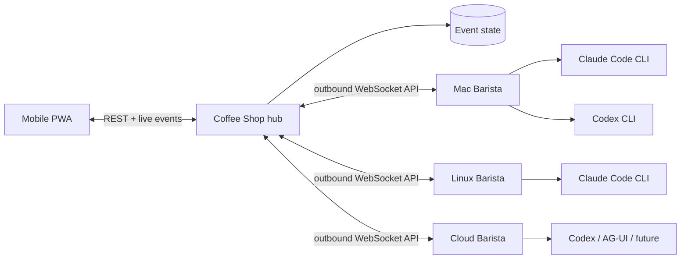

# Architecture

Coffee Shop separates identity, reasoning, and execution. That is the key choice that lets a C++ specialist remain the same agent while moving between Claude Code, Codex, and future harnesses or machines.

## Domain model

- **Agent** — stable identity, purpose, system prompt, workspace, and current state.
- **Harness** — an adapter for a model-running product. It owns invocation and event normalization, not identity.
- **Compute node** — a machine with a connected Barista, local tools, credentials, allowlisted workspaces, and concurrency.
- **Thread** — a durable, archivable body of work containing conversation, execution trees, artifacts, and the evolving outcome.
- **Run** — one immutable dispatch decision: agent + harness + model + compute + task.
- **Handoff** — a visible edge from one agent/run to another, carrying bounded task context.
- **Event** — the append-only human-readable explanation of state changes.

The UI presents agents first, matching Grok Bot's useful primitive: you return to a recognizable coworker instead of managing disposable chats. Harness and machine are visible as operational context, but they do not replace the agent's identity.

## Runtime flow

1. The PWA sends a message to an agent. A top-level message creates a thread automatically; an explicit continuation reopens a completed thread.
2. The hub snapshots that thread ID plus the agent's harness, model, workspace, and compute assignment into a run.
3. If its Barista is connected, the hub dispatches immediately; otherwise the run remains queued and visible.
4. Barista verifies that the requested workspace resolves inside an allowlisted root.
5. The harness adapter spawns an official CLI without a shell and normalizes its event stream.
6. The hub persists output and state, then pushes a fresh snapshot to every UI.
7. Every harness receives a run-scoped Coffee Shop MCP capability from Barista. It can read bounded thread and task context, refine or complete the thread, publish workspace artifacts, and, when explicitly authorized as an orchestrator, create child runs capped at three levels and four children per run.

A thread can contain multiple root execution trees as people return with follow-up work. Delegated runs, artifacts, messages, and events inherit `threadId` from the authenticated source run; models cannot attach them to an arbitrary thread. The owner agent may refine thread metadata and mark the objective completed after delegated work settles. Archival is an operator-only, reversible transition, requires all runs to be terminal, and makes the thread read-only until it is reopened.

Barista serves MCP over authenticated Streamable HTTP on an ephemeral `127.0.0.1` port. MCP calls are correlated over the existing outbound control WebSocket; the hub remains the authority for task visibility, delegation policy, persistence, and dispatch. Capability tokens are opaque, unique to one active run, never replace the Barista enrollment token, and are revoked when that run terminates. Artifact metadata travels through the control protocol, while file bytes use the authenticated hub artifact endpoint so large content does not enter MCP JSON or the lifecycle event stream.

The legacy final-response `<handoff>` directive remains a rolling-upgrade fallback. MCP delegation is first-class and non-terminal: the parent keeps working and can query the child through `get_task_context`.

Queued and running runs may also transition to `cancelled`. The hub persists that terminal state and its timestamp before attempting best-effort delivery to Barista. Late lifecycle messages cannot move a terminal run or produce output, messages, events, or handoffs. Barista keeps an in-memory cancellation tombstone for each received cancel, terminates the harness process tree, acknowledges active cancellation after that tree exits, and suppresses both a not-yet-started dispatch and terminal output from cancelled work. The persisted hub run remains the authority across a Barista disconnect.

Queued runs record `dispatchedAt` when the hub makes a persisted delivery decision; node online status alone is not evidence that a run was sent. Replayed lifecycle persistence is retried in socket order. If it remains unavailable, that socket stops before its replay barrier, so uncertain work cannot be redispatched from stale state.

## Security boundaries in the MVP

- Baristas connect outbound and authenticate with the hub secret.
- Vendor credentials remain in vendor-owned CLI storage on the compute node.
- The hub never receives a Claude or OpenAI token.
- Commands use `spawn(binary, args)` rather than shell interpolation.
- Barista canonicalizes paths before enforcing `WORKSPACE_ROOTS`.
- Claude Code runs in auto permission mode with unanswered prompts denied.
- Codex runs with `workspace-write` sandboxing.
- Automatic agent handoffs have a hard depth limit.
- MCP binds every tool call to an active run and derives thread, node, agent, parent, and workspace identity server-side.
- Only agents explicitly configured to delegate receive the `delegate_task` tool.
- Artifact paths are canonicalized beneath the active workspace; the hub verifies uploaded size and SHA-256.

The shared hub token is suitable for a private single-user tailnet, not an internet-facing team deployment. Production multi-user work needs distinct user and Barista identities, TLS, scoped grants, and an audited policy gateway.

## Repository and deployment boundaries

The repository is polyglot by application boundary. `apps/web` and `apps/hub` participate in the pnpm workspace. `apps/control-agent` is an independent Go 1.26 module joined by the root `go.work`. Root Task targets compose builds and tests without making a compute host install the TypeScript toolchain.

The hub and frontend deploy together. Barista is built and distributed separately as a native executable. Its outbound `/control-agent` WebSocket uses protocol version `3`; the TypeScript and Go representations intentionally live on opposite sides of the deployment boundary. Version 2 introduced the `sync.complete` replay barrier, and version 3 adds correlated hub RPC for the run-scoped MCP bridge. The hub accepts versions 1 and 2 during rolling upgrades. Version 1 lifecycle reporting still fail-closes queued-run redispatch because it has no safe replay barrier; version 2 retains safe lifecycle and dispatch behavior without MCP.

## What to build next

The MVP deliberately proves the seams before adding infrastructure. Recommended order:

1. Replace the JSON snapshot with PostgreSQL and append-only run/event tables.
2. Add OIDC for users and per-Barista enrollment tokens with rotation.
3. Add a scheduler/lease table so multiple hub replicas cannot dispatch the same run.
4. Add approval events that can pause a harness and be resolved from the PWA.
5. Move artifact content from hub-local storage to object storage with signed upload and download URLs.
6. Add container/VM workspace providers and a policy engine before untrusted workloads.
7. Add AG-UI as an external harness adapter while preserving the same run/event model.
8. Add routines only after retries, idempotency, cancellation, and budgets are durable.

## Deliberate non-goals in this bootstrap

- No credential vault or credential proxy.
- No public multi-tenant auth.
- No unrestricted arbitrary shell harness.
- No pretend memory layer: durable memory needs provenance, retention, and compaction semantics.
- No direct SSH orchestration; a small outbound Barista is simpler to secure and works across NAT.
